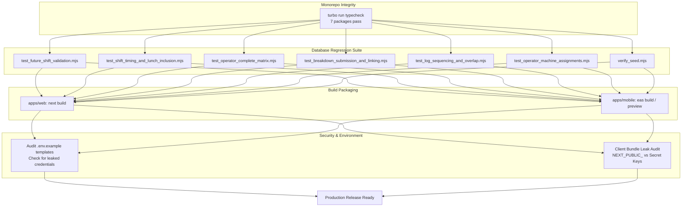

# Phase 15: Production Release & Deployment Verification - Research

**Researched:** 2026-09-09
**Domain:** Monorepo Production Build & Release Engineering, Supabase Integration Testing, Expo EAS Mobile Packaging, Environment Security Hardening
**Confidence:** HIGH

<user_constraints>
## User Constraints (from CONTEXT.md)

No user constraints — all decisions at the agent's discretion (context gate was skipped per user selection).

### Locked Decisions
- Target release artifacts: Next.js 16 web application, Expo SDK 54 mobile application with EAS build targets (Android APK/AAB, iOS IPA).
- All 6 backend test suites in `supabase/tests/*.mjs` must achieve 100% pass rate.
- Shared workspace packages (`@reachinternational/*`) must compile cleanly with 0 type errors across monorepo.
- Environment variables and credentials must be audited and locked with complete `.env.example` templates without leaking secrets.

### The Agent's Discretion
- Test script maintenance and assertion fixes to align with PostgreSQL migrations (047, 055).
- Build guard hardening in `apps/web/scripts/guard-build.js` to allow CI and local test builds.
- EAS build configuration adjustments for monorepo compatibility.
</user_constraints>

<architectural_responsibility_map>
## Architectural Responsibility Map

| Capability | Primary Tier | Secondary Tier | Rationale |
|------------|-------------|----------------|-----------|
| Database Integration Tests | Database / Supabase | Test Runner (Node.js) | Validates Postgres triggers, GiST constraints, RLS policies, and atomic RPCs against live Supabase instance |
| Monorepo Type Integrity | Workspace Root (Turbo) | All 7 Workspace Packages | Ensures strict TypeScript compiler compliance across packages before bundling |
| Web Production Bundle | Frontend Server (Next.js) | Vercel / Node Runtime | Validates Next.js 16 Turbopack production compilation, static asset optimization, and route handlers |
| Mobile Production Artifacts | Mobile Client (Expo EAS) | Expo Cloud / Android SDK | Configures EAS build profiles for Android APK (internal preview) and AAB (Play Store release) |
| Environment & Security Audit | Root & App Configs | CI/CD & Secret Stores | Locks `.env.example` documentation and ensures no server secrets leak to client-side bundles |
</architectural_responsibility_map>

<research_summary>
## Summary

Phase 15 represents the final hardening, automated verification, production build generation, and deployment sign-off for the ReachInternational platform.

Extensive research and diagnostic execution across the codebase revealed that the foundational code is in exceptional condition: `turbo run typecheck` passes with zero errors across all 7 packages, the database schema (56 migrations) is fully applied, and 3 out of 6 test suites pass cleanly right out of the box (`test_future_shift_validation.mjs`, `test_shift_timing_and_lunch_inclusion.mjs`, `test_operator_complete_matrix.mjs` with 75/75 passing tests).

However, three specific categories of issues were identified and must be addressed during Phase 15:
1. **Backend Test Suite Mismatches:** Three test scripts (`test_breakdown_submission_and_linking.mjs`, `test_log_sequencing_and_overlap.mjs`, `test_operator_machine_assignments.mjs`) have minor configuration or assertion mismatches with current schema rules (e.g. testing idempotency with future dates that trip migration 055's `chk_shift_end_not_in_future`; missing `.env` path loading in `test_log_sequencing_and_overlap.mjs`; and asserting raw SQLSTATE codes instead of the caught JSON RPC error objects in `test_operator_machine_assignments.mjs`).
2. **Web Production Build Guard:** `apps/web/scripts/guard-build.js` checks port 3000 to prevent local compiler cache corruption, but needs an override (such as `CI=true`, `VERCEL=1`, or `SKIP_BUILD_GUARD=1`) so automated verification and CI builds succeed without requiring manual process management.
3. **EAS Configuration & Secrets Audit:** Verification of `apps/mobile/eas.json`, `app.json`, and environment variable templates across `.env.example`, `apps/web/.env.example`, and `apps/mobile/.env.example` to ensure complete coverage for production deployments without secret leaks.

**Primary recommendation:** Fix the 3 test scripts to align with database migrations, verify 100% pass rate across all 6 test suites, configure `guard-build.js` for seamless build execution, and validate production builds across both web and mobile.
</research_summary>

<standard_stack>
## Standard Stack

### Core
| Tool / Library | Version | Purpose | Why Standard |
|----------------|---------|---------|--------------|
| Turborepo | ^2.10.11 | Monorepo task orchestration | Caches and executes build/typecheck pipelines across all packages |
| Next.js | 16.2.12 | Enterprise Web App & Server Actions | React 19 production framework with Turbopack |
| Expo / EAS CLI | SDK 54 / EAS >= 14 | Cross-platform Mobile Framework | Industry standard for React Native iOS/Android builds |
| Supabase JS Client | ^2.111.0 | Database & Auth Integration | PostgreSQL service role and client-side integration |
| Node.js / ESM | v20+ | Test Runner & Automation Scripts | Native ESM test execution with `@supabase/supabase-js` |

### Supporting
| Tool / Script | Purpose | When to Use |
|---------------|---------|-------------|
| `supabase/tests/*.mjs` | Automated end-to-end database regression test suite | Pre-deployment gate for all shift, operator, breakdown, and audit logic |
| `supabase/verify_seed.mjs` | Database seed data validation | Verifies relational integrity and seed counts across tables |
| `apps/web/scripts/guard-build.js` | Cache protection guard | Prevents Next.js `.next` directory compiler corruption during concurrent dev/build |
</standard_stack>

<architecture_patterns>
## Architecture Patterns

### Verification & Deployment Flow

### Detailed Diagnostics & Concrete Fixes

#### 1. `test_breakdown_submission_and_linking.mjs`
- **Issue:** Test 3b and 3c attempt to test idempotency duplicate insertion using `log_date: '2029-01-02'` and `end_datetime: '2029-01-02T14:00:00+05:30'`.
- **Root Cause:** Migration 055 introduced database constraint `chk_shift_end_not_in_future`, which fires on insert/update and rejects future shift dates with code `23514 ("Cannot log before shift end.")`. As a result, the test receives code 23514 instead of code 23505 (`idempotency_key` unique violation).
- **Fix:** In `test_breakdown_submission_and_linking.mjs`, use valid past dates (e.g. `'2024-01-02'`) for tests 3b and 3c so the date constraint passes and idempotency validation correctly exercises the unique key constraint.

#### 2. `test_log_sequencing_and_overlap.mjs`
- **Issue:** Fails immediately with `❌ Need at least 2 machines in database for testing. Found: 0`.
- **Root Cause:** The test script only attempts to load `../../.env.local` and `../../apps/web/.env.local`. In this monorepo, the primary credentials file is `../../.env`. Because neither `.env.local` exists, it fell back to a hardcoded legacy `anon` key. Under Row-Level Security (RLS), the anon key has no access to `machines`, returning 0 rows.
- **Fix:** Add `loadEnv(path.resolve(__dirname, '../../.env'))` and use `process.env.SUPABASE_SECRET_KEY` with fallback to `process.env.SUPABASE_SERVICE_ROLE_KEY`.

#### 3. `test_operator_machine_assignments.mjs`
- **Issue:** Tests 4, 5, and 6 fail:
  - Test 4 (4th operator capacity limit): Asserts `ass4.error.includes('MAX_OPERATORS_REACHED')`. But the atomic RPC returns `{ success: false, code: 'MAX_OPERATORS_REACHED', error: 'Machine ... has reached its maximum capacity...' }`. The code is `'MAX_OPERATORS_REACHED'`, not the error text.
  - Test 5 (GiST exclusion overlap): Asserts `assExclErr.code === '23P01'`. But the atomic RPC handles SQLSTATE `23P01` internally and returns `{ success: false, code: 'SHIFT_OVERLAP_CONFLICT', error: '...' }` with `assExclErr = null`.
  - Test 6 (End assignment) & cleanup: Uses `end_reason: 'completed'`, `'test_reset'`, and `'test_cleanup'`. PostgreSQL check constraint `operator_machine_assignments_end_reason_check` enforces `end_reason IN ('reassigned', 'removed', 'shift_changed', 'migrated')`.
- **Fix:** Update assertions to check `res?.code === 'MAX_OPERATORS_REACHED'`, `res?.code === 'SHIFT_OVERLAP_CONFLICT'`, and set `end_reason` / `p_end_reason` to `'removed'`.

#### 4. `apps/web/scripts/guard-build.js`
- **Issue:** Script checks if port 3000 is open and terminates with code 1 if a local dev server is running. While useful during local development to prevent `.next` compiler cache collisions, it blocks automated production build testing unless the dev server is manually killed.
- **Fix:** Add check for `process.env.CI || process.env.VERCEL || process.env.SKIP_BUILD_GUARD` to bypass the port check during automated testing and CI pipelines.

#### 5. Environment & Secrets Lockdown
- Audit `.env.example` in root, `apps/web/.env.example`, and `apps/mobile/.env.example`.
- Ensure all required production variables are documented:
  - Supabase URL & Public/Anon keys
  - Supabase Secret Key (web only)
  - Twilio SID, Auth Token, and Sender Numbers (web only)
  - SendGrid API Key and Sender info (web only)
  - Upstash QStash credentials for cron workflows (web only)
  - Mobile Expo Public URL and Scheme (mobile only)
- Confirm that `.gitignore` explicitly prevents `.env`, `.env.local`, `.env.*.local` from ever being staged.
</architecture_patterns>

<plan_breakdown>
## Plan Breakdown Strategy

To ensure clean execution and complete verification, Phase 15 is divided into two focused plans:

### Plan 15-01: Automated Backend Test Stabilization & Verification Suite
- Resolve test script assertions and environment loading in:
  - `supabase/tests/test_breakdown_submission_and_linking.mjs`
  - `supabase/tests/test_log_sequencing_and_overlap.mjs`
  - `supabase/tests/test_operator_machine_assignments.mjs`
- Execute all 6 test suites sequentially to verify 100% pass rate:
  1. `test_future_shift_validation.mjs`
  2. `test_shift_timing_and_lunch_inclusion.mjs`
  3. `test_operator_complete_matrix.mjs`
  4. `test_breakdown_submission_and_linking.mjs`
  5. `test_log_sequencing_and_overlap.mjs`
  6. `test_operator_machine_assignments.mjs`
- Run `verify_seed.mjs` to ensure seed integrity across all tables.

### Plan 15-02: Production Build Packaging, EAS Setup & Secret Lockdown
- Update `apps/web/scripts/guard-build.js` to recognize `SKIP_BUILD_GUARD` and CI flags.
- Execute full monorepo build (`pnpm turbo run build`) verifying clean compilation across all 7 workspaces.
- Verify `apps/mobile/eas.json` build profiles (preview APK, production AAB) and validate Expo bundle export (`npx expo export`).
- Audit environment variable documentation across `.env.example`, `apps/web/.env.example`, and `apps/mobile/.env.example`.
- Perform client bundle secret audit ensuring no private keys are bundled into `@reachinternational/web` or `@reachinternational/mobile`.
</plan_breakdown>
