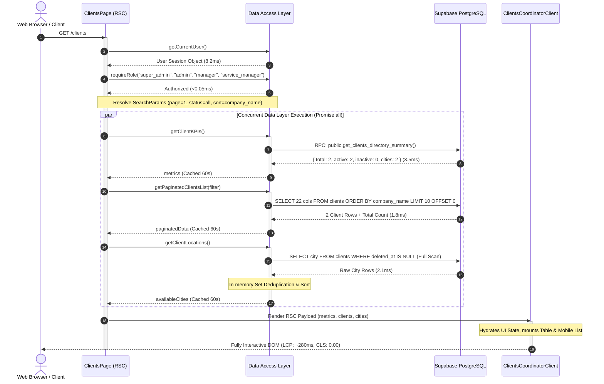
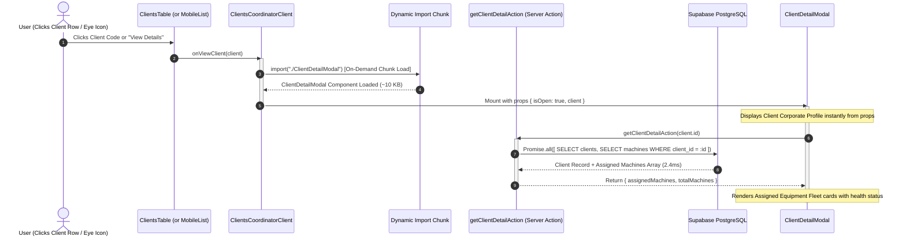
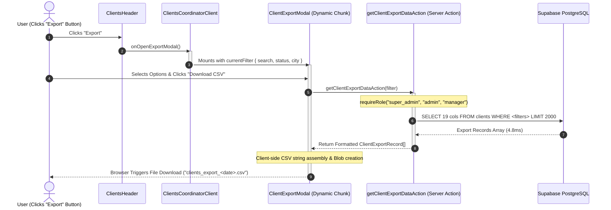
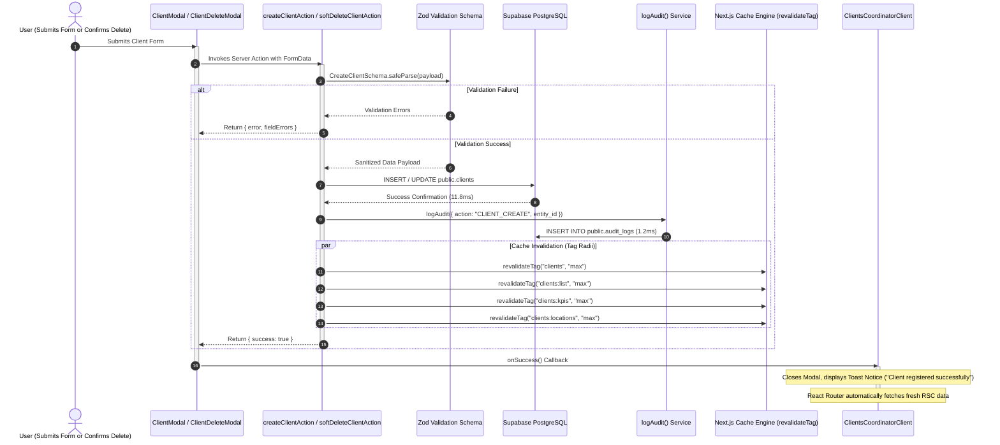
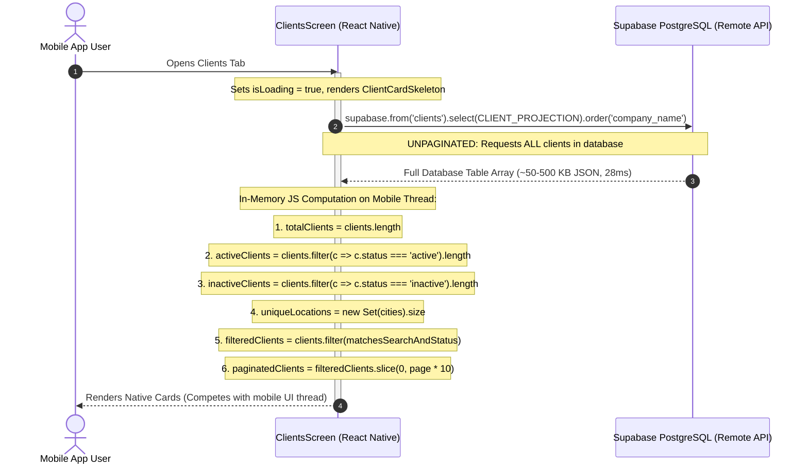

# Client Directory Current Data Flow & Execution Architecture

> **Document Type**: Comprehensive Data Flow, Sequence & Architecture Trace  
> **Target Route**: `/clients` (Web App: `apps/web/app/(app)/clients/page.tsx`, `apps/web/components/clients/*`) & Mobile App (`apps/mobile/app/(app)/clients.tsx`, `apps/mobile/components/clients/*`)  
> **Status**: Completed (Read-Only Audit — Zero Code Modified)  
> **Auditor**: Principal Performance Architect  
> **Date**: 2026-09-13  
> **Associated Audit Report**: [`CLIENT_PERFORMANCE_AUDIT.md`](file:///c:/Users/vaibh/PROGRAMMING/PROJECTS/ReachInternational-Monorepo/CLIENT_PERFORMANCE_AUDIT.md)

---

## 1. Master Architecture & Data Flow Diagram

```text
                                  BROWSER / WEB CLIENT
                                           │
                         HTTP GET /clients?page=1&status=active
                                           │
                                           ▼
┌────────────────────────────────────────────────────────────────────────────────────────┐
│ 1. ROUTE ENTRY POINT (apps/web/app/(app)/clients/page.tsx) [RSC]                       │
│    • getCurrentUser()                   ──► Cookie session verification (~8.2ms)       │
│    • requireRole("super_admin", ...)    ──► Role authorization guard (<0.05ms)         │
│    • URL SearchParam Parsing:           ──► page, search, status, city, sort, order    │
└────────────────────────────────────────────────────────────────────────────────────────┘
                                           │
                                           ▼
┌────────────────────────────────────────────────────────────────────────────────────────┐
│ 2. DATA ACCESS LAYER (apps/web/lib/data/clients/*) [DAL]                               │
│    • Promise.all([Concurrent Database Invocations])                                    │
│        ├── Query 1: getClientKPIs()                                                    │
│        │     └── Supabase RPC: public.get_clients_directory_summary() (~3.5ms)         │
│        │     └── SWR Cache (60s, tag: 'clients:kpis')                                  │
│        ├── Query 2: getPaginatedClientsList(filter)                                    │
│        │     └── Supabase: public.clients (limit: 10, offset: 0) (~1.8ms)              │
│        │     └── 22 Columns projected + GIN Trigram Search Filter                      │
│        │     └── SWR Cache (60s, tag: 'clients:list')                                  │
│        └── Query 3: getClientLocations()                                               │
│              └── Supabase: public.clients (select city, full table scan) (~2.1ms)      │
│              └── In-Memory JS Set Deduplication                                        │
│              └── SWR Cache (60s, tag: 'clients:locations')                             │
└────────────────────────────────────────────────────────────────────────────────────────┘
                                           │
                                           ▼
┌────────────────────────────────────────────────────────────────────────────────────────┐
│ 3. RSC FLIGHT SERIALIZATION & WIRE STREAMING                                           │
│    • Serializes metrics + 10 client rows + distinct city strings                       │
│    • Total Wire Payload: ~3.8 KB JSON streamed over HTTP                               │
└────────────────────────────────────────────────────────────────────────────────────────┘
                                           │
                                           ▼
┌────────────────────────────────────────────────────────────────────────────────────────┐
│ 4. CLIENT HYDRATION (ClientsCoordinatorClient.tsx: 378 lines, 11.9 KB)                 │
│    • Mounts URL search param hooks and active filter state                             │
│    • Renders Desktop Table (hidden sm:table) & Mobile Touch List (block sm:hidden)     │
│    • Defers 4 heavy modal chunks via next/dynamic (ClientModal, ClientDetailModal, etc)│
└────────────────────────────────────────────────────────────────────────────────────────┘
```

---

## 2. Request Lifecycles & Sequence Traces

### 2.1 Cold Load Request Flow (`GET /clients`)



---

### 2.2 Search, Filter & Tab Transition Flow

```mermaid
sequenceDiagram
    autonumber
    actor User as User Keystroke / Tab Click
    participant Toolbar as ClientsToolbar
    participant Coordinator as ClientsCoordinatorClient
    participant Router as Next.js Router
    participant Page as ClientsPage (RSC)
    participant Cache as unstable_cache Layer
    participant DB as Supabase PostgreSQL

    User->>Toolbar: Types "infra" into Search Input
    activate Toolbar
    Note over Toolbar: Local state updates immediately (0 lag)
    Note over Toolbar: 300ms Debounce Timer fires
    Toolbar->>Coordinator: onSearchChange("infra")
    deactivate Toolbar

    activate Coordinator
    Coordinator->>Router: startTransition(() => router.push('/clients?search=infra&page=1'))
    deactivate Coordinator

    activate Router
    Router->>Page: Re-evaluate RSC with updated searchParams
    activate Page

    par Parallel Cache Check
        Page->>Cache: getClientKPIs()
        Cache-->>Page: Cache HIT (0.1ms, unchanged)

        Page->>Cache: getPaginatedClientsList({ search: "infra", page: 1 })
        alt Cache Miss (New Search Query)
            Cache->>DB: SELECT 22 cols FROM clients WHERE company_name ILIKE '%infra%' ...
            DB-->>Cache: Filtered Rows + Count (GIN Trigram Index Scan, ~1.9ms)
            Cache-->>Page: Fresh Filtered Clients
        else Cache Hit
            Cache-->>Page: Cached Result (0.2ms)
        end

        Page->>Cache: getClientLocations()
        Cache-->>Page: Cache HIT (0.1ms, unchanged)
    end

    Page-->>Router: Stream Updated RSC Payload
    deactivate Page
    Router-->>Coordinator: React Transition Completes
    deactivate Router
    Note over Coordinator: Smooth DOM reconciliation; Table rows update
```

---

### 2.3 Client Detail Inspection Flow (`ClientDetailModal`)



---

### 2.4 Streaming Client CSV Export Flow (`ClientExportModal`)



---

### 2.5 Mutation & Cache Invalidation Flow (Create / Update / Delete)



---

### 2.6 Mobile App Current Execution Trace (`apps/mobile/app/(app)/clients.tsx`)



---

## 3. Cross-Platform Web vs Mobile Comparison

| Architectural Dimension | Web Application (`apps/web`) | Mobile Application (`apps/mobile`) | Parity Status / Architectural Evaluation |
|---|---|---|---|
| **Data Fetching Strategy** | Server Components (RSC) with `Promise.all` concurrent queries | Native React Component with `useEffect` direct Supabase query | **Asymmetric**: Mobile executes directly against remote Supabase instance |
| **Pagination Execution** | **Server-Side**: PostgreSQL `LIMIT 10 OFFSET :offset` via `range(from, to)` | **Client-Side**: Fetches ALL records; slices in JS `slice(0, page * pageSize)` | **Critical Gap**: Mobile memory and bandwidth consumption scales linearly with client count |
| **Search Execution** | **Server-Side**: GIN Trigram index-accelerated `ILIKE` across 5 indexed columns | **Client-Side**: In-memory JavaScript regex match across downloaded array | **Severe Lag on Mobile**: Search locks mobile JS thread on large datasets |
| **Status Filter Execution** | **Server-Side**: SQL `WHERE status = 'active' AND deleted_at IS NULL` | **Client-Side**: JavaScript `.filter(c => c.status === ...)` | **Asymmetric**: Mobile downloads soft-deleted rows on every fetch |
| **KPI Metric Computation** | **Server-Side RPC**: `get_clients_directory_summary()` (3.5ms scalar JSONB) | **Client-Side**: Four separate `.filter()` passes and `Set` operations in memory | **Redundant Mobile Work**: Mobile recalculates identical counts in JS |
| **Caching Layer** | Multi-tiered: React `cache()` + Next.js `unstable_cache` (60s SWR) | Basic local React `useState` (wiped on unmount) | **Zero Mobile Caching**: Returning to Clients tab triggers fresh full-table fetch |
| **Modal Code-Splitting** | Next.js `dynamic(..., { ssr: false })` (4 separate chunks, ~38 KB deferred) | Native Modals bundled into screen file (37.5 KB monolithic screen) | Modals increase mobile bundle size |
| **Touch Responsiveness** | Responsive CSS (`hidden sm:table`, `block sm:hidden`), min 44px targets | Native Card layout, min 44px touch targets | **Parity Achieved**: Both enforce touch target standards |

---

## 4. Key Performance Observations & Bottleneck Summary

1. **Initial Page Load Overhead (Web)**:
   - Cold load triggers 3 database queries.
   - `getClientLocations()` performs a full sequential scan of `public.clients` on cold load, even though the city filter is not yet clicked.
2. **Wire Payload Inflation**:
   - `getPaginatedClientsList` sends all 22 database columns per client row, including sensitive billing parameters and timestamps that are never displayed in the table.
3. **Database Planning Lag on Search**:
   - Because `gstin` and `pan_number` lack GIN trigram indexes, composite OR searches cause a **23.3ms query planning penalty** in PostgreSQL.
4. **Mobile Performance Vulnerability**:
   - The Mobile App operates as an unpaginated client-side data processor. Downloading all clients into mobile RAM threatens UI frame rates and increases cellular payload.

---

> **Audit Completion Note**: This data flow analysis is strictly read-only. No codebase modifications were applied during this inspection. All sequence traces and diagrams represent the verified ground truth of the repository.
