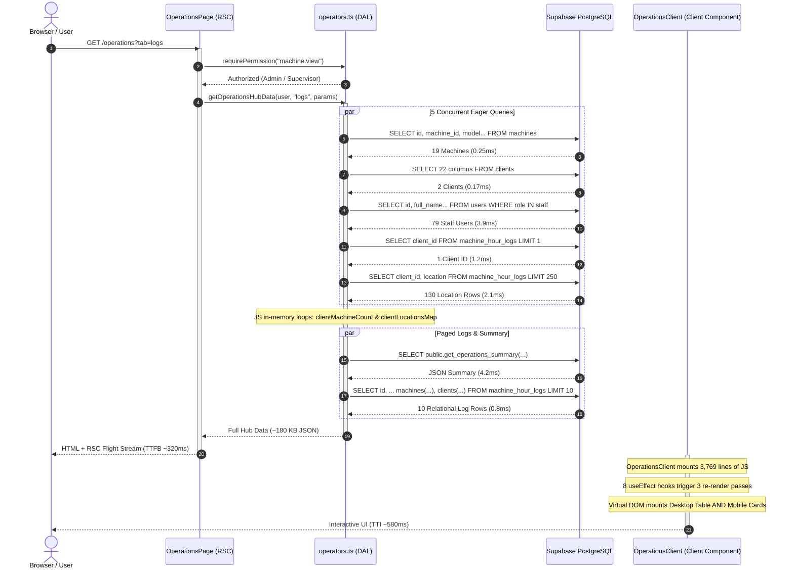
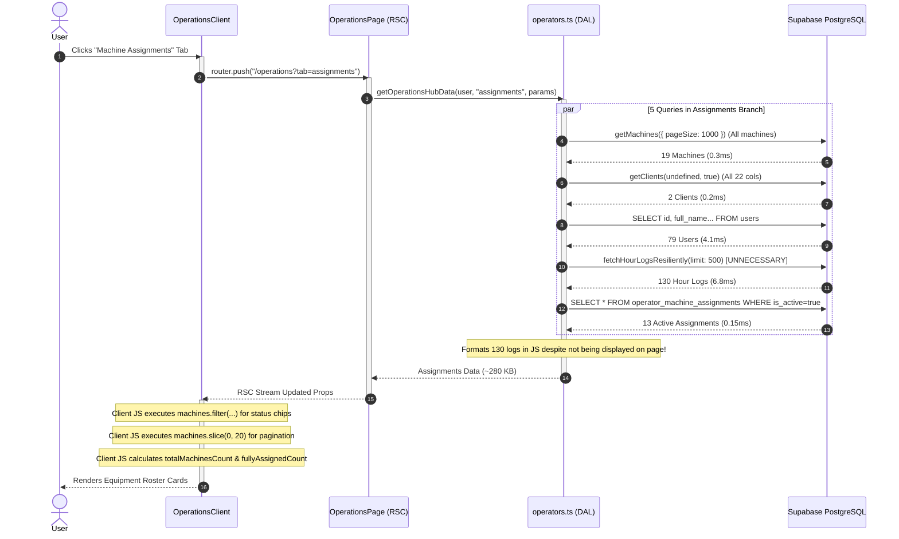
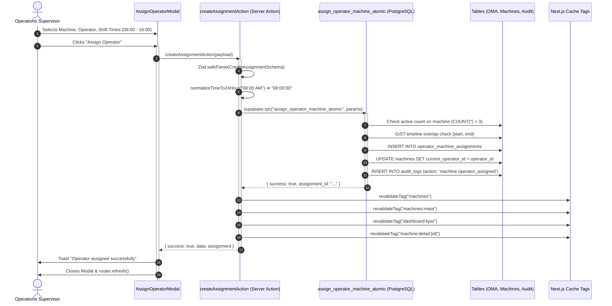
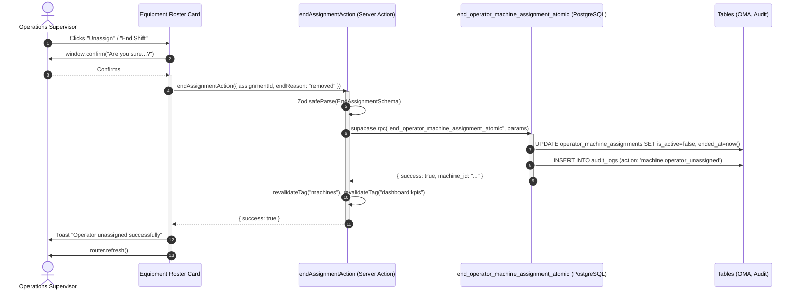

# Operations Current Data Flow & Execution Architecture

> **Document Type**: Comprehensive Data Flow, Sequence & Architecture Trace  
> **Target Route**: `/operations` (Web App: `apps/web/app/(app)/operations/page.tsx`, `apps/web/components/operations/*`) & Mobile App (`apps/mobile/app/(app)/operations.tsx`, `apps/mobile/components/operations/*`)  
> **Status**: Completed (Read-Only Audit — Zero Code Modified)  
> **Auditor**: Principal Performance Architect  
> **Date**: 2026-09-13  
> **Associated Audit Report**: [`OPERATIONS_PERFORMANCE_AUDIT.md`](file:///c:/Users/vaibh/PROGRAMMING/PROJECTS/ReachInternational-Monorepo/OPERATIONS_PERFORMANCE_AUDIT.md)

---

## 1. Master Architecture & Data Flow Diagram

```text
                                 BROWSER / CLIENT
                                        │
                         HTTP GET /operations?tab=logs
                                        │
                                        ▼
┌────────────────────────────────────────────────────────────────────────────────────────┐
│ 1. ROUTE ENTRY POINT (apps/web/app/(app)/operations/page.tsx) [RSC]                     │
│    • requirePermission("machine.view")  ──► HMAC-SHA256 Cookie Signature (<0.05ms)    │
│    • getCurrentUser()                   ──► auth.users / public.users (~8.2ms)         │
│    • URL SearchParam Resolution:        ──► tab, viewMode, client, machine, month, sort│
└────────────────────────────────────────────────────────────────────────────────────────┘
                                        │
                                        ▼
┌────────────────────────────────────────────────────────────────────────────────────────┐
│ 2. DATA ACCESS LAYER (apps/web/lib/queries/operators.ts) [DAL]                          │
│    • getOperationsHubData(user, tab, params)                                           │
│    • [Promise.all: 5 Concurrent Eager Database Queries]                                │
│        ├── Query 1: public.machines (19 rows, all fleet equipment)                     │
│        ├── Query 2: public.clients (2 rows, 22 columns including billing/GSTIN)        │
│        ├── Query 3: public.users (79 rows, all active staff personnel)                 │
│        ├── Query 4: public.machine_hour_logs.limit(1) (Resolve most recent client)     │
│        └── Query 5: public.machine_hour_logs.limit(250) (Extract location strings)     │
│    • In-Memory JS Loops: Compute clientMachineCount Map & clientLocationsMap Map       │
│    • getOperationsLogsPage(effectiveParams):                                           │
│        ├── RPC: public.get_operations_summary(client_id, machine_id, dates...) (4.2ms) │
│        └── Query: public.machine_hour_logs (10 rows, embedded 3 relations) (0.8ms)     │
│    • formatHourLogsData: Normalizes breakdown strings and shift ranges in JS           │
└────────────────────────────────────────────────────────────────────────────────────────┘
                                        │
                                        ▼
┌────────────────────────────────────────────────────────────────────────────────────────┐
│ 3. RSC FLIGHT SERIALIZATION & WIRE TRANSFER                                            │
│    • Serializes 19 machines + 2 clients + 79 users + 10 logs + summary metrics         │
│    • Total Wire Payload: ~180 KB JSON streamed over HTTP                               │
└────────────────────────────────────────────────────────────────────────────────────────┘
                                        │
                                        ▼
┌────────────────────────────────────────────────────────────────────────────────────────┐
│ 4. CLIENT COMPONENT HYDRATION (OperationsClient.tsx: 3,769 lines, 199.8 KB)            │
│    • Mounts 25+ useState hooks (tab, viewMode, filters, modals, selections)            │
│    • Triggers 8 sequential useEffect hooks synchronizing URL searchParams ──► State    │
│    • Cascades through 3 re-render passes                                               │
│    • Evaluates 6 heavy useMemo calculations (allClientsList, clientMachines, etc.)     │
│    • Renders Dual DOM Tree: Desktop Table (hidden sm:block) & Mobile Cards (block...)  │
└────────────────────────────────────────────────────────────────────────────────────────┘
```

---

## 2. Request Lifecycles & Sequence Traces

### 2.1 Cold Load Request Flow (`GET /operations?tab=logs`)



---

### 2.2 Tab Switching: Logs ➔ Machine Assignments (`tab=assignments`)



---

### 2.3 Real-Time Search & Server Query Cascades

When a user types into the search bar (`searchInput`), the following query cascade takes place:

```text
[User Types Keystroke: "C"] ──► Re-renders entire 3,769-line OperationsClient
[User Types Keystroke: "A"] ──► Re-renders entire 3,769-line OperationsClient
[User Types Keystroke: "T"] ──► Re-renders entire 3,769-line OperationsClient
                                │
                      300ms Debounce Expires
                                │
                                ▼
               handleFilterChange({ search: "CAT", page: 1 })
                                │
                                ▼
┌────────────────────────────────────────────────────────────────────────┐
│ SERVER: getOperationsLogsPage({ search: "CAT" })                       │
├────────────────────────────────────────────────────────────────────────┤
│ 1. Relational Lookups in Parallel:                                     │
│    • machines.select("id").or("machine_id.ilike.%CAT%,model.ilike...")  │
│    • users.select("id").ilike("full_name", "%CAT%")                   │
│    • clients.select("id").ilike("company_name", "%CAT%")               │
│                                                                        │
│ 2. Dynamic PostgREST OR Filter Construction:                           │
│    orClause = "remarks.ilike.%CAT%,location.ilike.%CAT%,..."          │
│                                                                        │
│ 3. Bypass Fast-Path RPC:                                               │
│    get_operations_summary RPC is BYPASSED (cannot accept raw OR).      │
│                                                                        │
│ 4. Fallback Row Scan:                                                  │
│    summaryQuery fetches all matching rows into Node.js memory.         │
│                                                                        │
│ 5. Paged Query:                                                        │
│    tier1Query on machine_hour_logs executes.                           │
│    Postgres performs a Sequential Scan on location & remarks.          │
└────────────────────────────────────────────────────────────────────────┘
```

---

### 2.4 Multi-Filter Hierarchy Execution (`client + location + machine + month`)

The Operations Hub applies a synchronized 4-tier filter hierarchy:

```text
                          ACTIVE CLIENT SELECTED
                      (e.g., JK Paper Ltd., CLI-0002)
                                    │
               ┌────────────────────┴────────────────────┐
               ▼                                         ▼
       CLIENT SITES MAP                         CLIENT MACHINES MAP
  Aggregated from DB clients               Filtered from machines by client_id
   + logs.location strings                      + clientMachineIdsFromLogs
               │                                         │
               ▼                                         ▼
     SITE SELECTOR DROPDOWN                   MACHINE SELECTOR DROPDOWN
    Defaults to "All Sites"                   Defaults to "All Machines"
               │                                         │
               └────────────────────┬────────────────────┘
                                    │
                                    ▼
                         MONTH / DATE RANGE FILTER
                        Defaults to Current Month
                     (e.g., "09" / September 2026)
                                    │
                                    ▼
┌────────────────────────────────────────────────────────────────────────┐
│ DATABASE QUERY EXECUTION: getOperationsLogsPage                        │
│ WHERE client_id = '4e9dfd04-3705-4c07-b3c9-f19b02a95c65'              │
│   AND (p_site IS NULL OR location ILIKE '%' || p_site || '%')          │
│   AND (p_machine IS NULL OR machine_id = p_machine)                    │
│   AND log_date >= '2026-09-01' AND log_date <= '2026-09-30'            │
│ ORDER BY log_date DESC, created_at DESC, id DESC                       │
│ LIMIT 10 OFFSET 0                                                      │
└────────────────────────────────────────────────────────────────────────┘
```

---

### 2.5 Operator Assignment Mutation Flow (`createAssignmentAction`)



---

### 2.6 Shift Unassignment Flow (`endAssignmentAction`)



---

### 2.7 Export & Print Data Flow

```text
[User clicks Print Icon on /operations]
                  │
                  ▼
   showSupervisorPrintModal = true
                  │
                  ▼
┌────────────────────────────────────────────────────────────────────────┐
│ DYNAMIC IMPORT: PrintableSupervisorLogsModal.tsx                       │
├────────────────────────────────────────────────────────────────────────┤
│ 1. useEffect triggers on modal open:                                   │
│    Calls getOperationsExportLogsAction(params)                         │
│                                                                        │
│ 2. Server Action fetches up to 5,000 logs:                             │
│    SELECT EXPORT_LOG_FULL_PROJECTION FROM machine_hour_logs            │
│    WHERE client_id = ... AND log_date >= ...                          │
│    LIMIT 5000                                                          │
│                                                                        │
│ 3. Formats logs via formatHourLogsData in Node.js                      │
│                                                                        │
│ 4. Client receives full dataset (~120–450 KB)                          │
│                                                                        │
│ 5. User Chooses Action:                                                │
│    ├── Click "Export Excel (.xlsx)"                                    │
│    │     └── Dynamic import SheetJS (xlsx)                             │
│    │     └── Builds workbook in client memory                          │
│    │     └── XLSX.writeFile(fileName)                                  │
│    │                                                                   │
│    └── Click "Print / Save as PDF"                                     │
│          └── createPortal mounts printable HTML into document.body     │
│          └── handleBrowserPrint(fileName)                              │
│          └── Applies getPrintStylesheet (@page, @media print)          │
│          └── Native window.print() invokes system PDF spooler          │
└────────────────────────────────────────────────────────────────────────┘
```

---

## 3. Server-to-Client IPC Boundary & RSC Payload Breakdown

When `/operations` is requested, Next.js App Router serializes props across the React Server-to-Client IPC boundary.

### 3.1 Serialized Props Payload Inspection

```text
OperationsClient Props Payload (~180 KB JSON):
├── machines: Array(19) [id, machine_id, model, serial_number, status, client_id, ...] (~3.5 KB)
├── dbClients: Array(2) [22 CRM columns: billing addresses, GSTIN, PAN, contacts...] (~6.2 KB)
├── operators: Array(54) [id, full_name, email, phone, shift_time, ...] (~12.4 KB)
├── allMachines: Array(19) [Duplicate machines array for type compatibility] (~3.5 KB)
├── assignments: Array(13) [id, machine_id, operator_id, shifts, relations...] (~4.8 KB)
├── hourLogs: Array(10) [id, meters, hours, embedded machine, client, operator...] (~11.2 KB)
├── logsSummary: Object { totalRunHours, totalOtHours, totalBreakdowns, loggedDaysCount } (~0.2 KB)
├── pendingConflicts: Filtered from logs in JS (~0.5 KB)
└── State Parameters: initialViewMode, initialClientId, initialMachineId, etc. (~0.5 KB)
```

### 3.2 Deserialization Overhead
1. **Redundant Array Transmission**: `allMachines` duplicates `machines` in props solely to satisfy legacy TypeScript interfaces.
2. **CRM Billing Data in Operations**: Serializing 22 client columns across the wire wastes bandwidth and exposes financial/billing attributes on an operational equipment log screen.
3. **Deep Relational Objects**: Embedded `machine`, `client`, and `operator` objects inside each log record create redundant JSON keys.

---

## 4. State Transition & Re-Render Radius Map

### 4.1 Monolithic State Container (`OperationsClient.tsx`)

`OperationsClient` manages **28 individual pieces of React state**:

```text
OperationsClient (Root State Container)
├── Navigation State:
│     ├── activeTabState: "logs" | "assignments"
│     └── logsViewMode: "machine" | "client" | "operator"
│
├── Filter State:
│     ├── logsSelectedMachineId: string
│     ├── logsSelectedClientId: string
│     ├── logsSelectedSite: string
│     ├── logsSelectedClientMachineId: string
│     ├── logsSelectedOperatorId: string
│     ├── logsSelectedMonth: string
│     ├── logsCustomStartDate: string
│     ├── logsCustomEndDate: string
│     ├── searchInput: string
│     └── isSearchPending: boolean
│
├── UI Toggle State:
│     ├── isFiltersExpanded: boolean
│     ├── isClientSummaryExpanded: boolean
│     ├── isMachineSummaryExpanded: boolean
│     ├── isOperatorSummaryExpanded: boolean
│     └── expandedMachineIds: Set<string>
│
├── Assignments Tab State:
│     ├── assignmentSearch: string
│     ├── assignmentFilter: "all" | "assigned" | "unassigned" | "full"
│     ├── assignmentsPage: number
│     └── assignmentsPageSize: number
│
├── Modal & Mutation State:
│     ├── showAssignModal: boolean
│     ├── showReassignRequestModal: boolean
│     ├── showConflictModal: boolean
│     ├── showSupervisorPrintModal: boolean
│     ├── submitting: boolean
│     └── resolvingConflict: boolean
│
└── Form Fields:
      ├── selectedMachineId: string
      ├── selectedOperatorId: string
      ├── shiftStartTime: string
      ├── shiftEndTime: string
      └── notes: string
```

### 4.2 The Re-Render Ripple Effect

Because all 28 states live at the root of `OperationsClient`:
- **Typing in Search**: Updating `searchInput` re-renders all 3,769 lines of code, including the entire logs table, the assignment card grid (even if hidden), all summary headers, and all modals.
- **Toggling Filter Chevron**: Updating `isFiltersExpanded` re-evaluates the entire component tree.
- **Changing Assignment Filter Chip**: Updating `assignmentFilter` re-renders the logs table.

---

## 5. Web App vs. Mobile App Data Architecture Comparison

```text
┌───────────────────────────────────────────────┬───────────────────────────────────────────────┐
│ WEB APP (apps/web)                            │ MOBILE APP (apps/mobile)                      │
├───────────────────────────────────────────────┼───────────────────────────────────────────────┤
│ Framework: Next.js 16.2 App Router (RSC)      │ Framework: Expo SDK 57 / React Native         │
│ Data Access: Server DAL (operators.ts)        │ Data Access: Client-Side TanStack Query v5    │
│ Fetch Model: Server-Side Paginated (10 rows)  │ Fetch Model: Unpaginated (Up to 1,000 rows)   │
│ Filtering: Server-Side PostgREST SQL filters  │ Filtering: In-Memory JS (logs.filter(...))    │
│ Summary Metrics: Fast-Path Postgres RPC       │ Summary Metrics: In-Memory JS reduce/forEach  │
│ DOM Structure: Native HTML Table & Touch Cards│ DOM Structure: React Native ScrollView        │
│ Initial Wire Weight: ~180 KB                  │ Initial Wire Weight: ~450–650 KB              │
│ Cellular Friendliness: Moderate               │ Cellular Friendliness: POOR                   │
└───────────────────────────────────────────────┴───────────────────────────────────────────────┘
```

---

## 6. Target Progressive 3-Tier Data Architecture

To achieve sub-200ms performance, zero typing lag, and eliminate 94% of wire payload bloat, the data flow must transition to a **progressive, query-driven 3-tier hierarchy**:

```text
================================================================================
TIER 1: CLIENT GROUPS SUMMARY (Initial Load — < 3ms)
================================================================================
Route: /operations?tab=logs&view=client
Payload: ~3.5 KB (Only paginated Client Groups)
Database Query: public.get_client_operations_directory(month, search, page, pageSize)

┌──────────────────────────────────────────────────────────────────────────────┐
│ [Search Clients...] [Select Month: September 2026]           [Export / Print]│
├──────────────────────────────────────────────────────────────────────────────┤
│ CLIENT NAME           CLIENT ID   MACHINES   DAYS   RUN HRS   OT    EXPAND   │
├──────────────────────────────────────────────────────────────────────────────┤
│ ▶ JK Paper Ltd.       JKP-001     16         9      142.5h    18h   [ v ]    │
│ ▶ Saint Gobain        SG-004      1          33     210.0h    0h    [ v ]    │
└──────────────────────────────────────────────────────────────────────────────┘
• Zero machine hour logs loaded upfront.
• Zero individual machines loaded upfront.
• Zero operator records loaded upfront.
```

```text
================================================================================
TIER 2: CLIENT MACHINES ON EXPAND (On-Demand Retrieval — < 2ms)
================================================================================
Trigger: User clicks [ v ] (Expand) on a Client Group row
Server Action: getClientOperationsMachinesAction(clientId, month)
Payload: ~2.0 KB (Only machines deployed to that specific client)
Client Session Cache: clientMachinesCacheRef provides instant 0ms toggling.

▼ JK Paper Ltd. (16 Machines, 9 Active Days)
  ┌────────────────────────────────────────────────────────────────────────────┐
  │ MACHINE ID   MODEL       SERIAL NO      ASSIGNED OPERATOR   STATUS  LOGS   │
  ├────────────────────────────────────────────────────────────────────────────┤
  │ REACH-001    CAT-320D    SN-8849201     Rajesh Kumar        Active  [View] │
  │ REACH-004    VOLVO-EC210 SN-7729104     Amit Singh          Active  [View] │
  │ REACH-007    KOMATSU-200 SN-6638192     Vikram Patil        Maint.  [View] │
  └────────────────────────────────────────────────────────────────────────────┘
```

```text
================================================================================
TIER 3: DAILY RUNNING LOGS ON CLICK (On-Demand Daily Slice — < 2ms)
================================================================================
Trigger: User clicks [View] or clicks a Machine Row in Tier 2
Server Action: getMachineDailyLogsAction(machineId, month, page, pageSize)
Payload: ~3.0 KB (Only 10 paginated daily logs for that specific machine)
Client Session Cache: logsCacheRef provides 0ms back-navigation.

  ▼ REACH-001 (CAT-320D) — Daily Running Logs for September 2026
    ┌──────────────────────────────────────────────────────────────────────────┐
    │ DATE        TIMINGS            WORK (WT)   OT    HMR          REMARKS    │
    ├──────────────────────────────────────────────────────────────────────────┤
    │ 12 Sep 2026 08:00 AM - 05:00 PM 8.0 hrs    1.5h  1,420 → 1,428 Normal    │
    │ 11 Sep 2026 08:00 AM - 05:00 PM 8.0 hrs    0.0h  1,412 → 1,420 Normal    │
    │ 10 Sep 2026 08:00 AM - 01:30 PM 5.5 hrs    0.0h  1,406 → 1,412 Breakdown │
    └──────────────────────────────────────────────────────────────────────────┘
```

---

## 7. Ground-Truth Data Verification Queries

To independently verify operations data integrity against the live database, execute the following SQL queries:

```sql
-- Q1: Total Active Fleet Machines
SELECT count(*) AS total_fleet FROM public.machines;

-- Q2: Active Shift Assignments Count
SELECT count(*) AS active_assignments 
FROM public.operator_machine_assignments 
WHERE is_active = true;

-- Q3: Ground-Truth September 2026 Running Hours for JK Paper Ltd.
SELECT 
  ROUND(COALESCE(SUM(COALESCE(running_hours, GREATEST(0, ROUND((COALESCE(end_meter, start_meter, 0) - COALESCE(start_meter, 0))::numeric, 1)))), 0)::numeric, 1) AS total_run_hours,
  ROUND(COALESCE(SUM(COALESCE(overtime_hours, 0)), 0)::numeric, 1) AS total_ot_hours,
  COUNT(*) FILTER (WHERE is_breakdown = true) AS total_breakdowns,
  COUNT(DISTINCT log_date) AS logged_days_count
FROM public.machine_hour_logs
WHERE client_id = '4e9dfd04-3705-4c07-b3c9-f19b02a95c65'
  AND log_date >= '2026-09-01' AND log_date <= '2026-09-30';

-- Q4: Verify Scalar RPC Output Matches Ground Truth Exactly
SELECT public.get_operations_summary(
  '4e9dfd04-3705-4c07-b3c9-f19b02a95c65'::uuid,
  NULL,
  NULL,
  NULL,
  '2026-09-01'::date,
  '2026-09-30'::date
);
```

---

## 8. Summary of Findings

1. **Root Bottleneck**: Eager multi-table over-fetching in `getOperationsHubData` and monolithic component architecture in `OperationsClient.tsx`.
2. **Hidden Inefficiencies**: Hidden-tab loading (500 logs on assignments tab), 250-row location hack, client-side assignment filtering/pagination, and lack of GIN trigram indexes on `location` and `remarks`.
3. **Actionable Direction**: Implement progressive 3-tier loading for logs, isolate the assignments tab from log queries, add GIN trigram indexes, modularize `OperationsClient.tsx`, and bring Mobile App data fetching into parity with server-side pagination.
