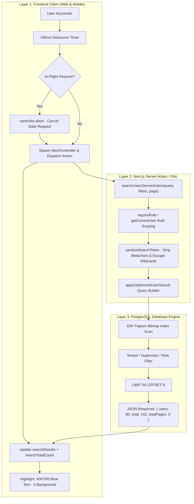

# Universal Enterprise High-Scale Search System — Architecture & Developer Guide

This document is the definitive guide to the **Enterprise High-Scale Search System** engineered across the ReachInternational Monorepo (`apps/web` and `apps/mobile`) for **100,000+ records**.

---

## 1. Why Pure Client-Side Fails at 100,000+ Users & Records

In initial prototypes or small directories (e.g., <500 items), downloading all rows to client RAM allows instant filtering. However, for an enterprise system targeting **100,000+ users, machines, or operations**, pure client-side search is fundamentally broken:

| Performance Dimension | Client In-Memory Prefetch (100k) | Pure PostgreSQL GIN Trigram Search (100k) |
| :--- | :--- | :--- |
| **Network Payload Size** | **35 MB – 50 MB** uncompressed JSON | **~10 KB – 15 KB** (top 50 matches slice) |
| **Initial Network Transfer Time** | **3,000ms – 15,000ms** (catastrophic on 4G) | **40ms – 80ms** total round trip |
| **Browser V8 Heap Memory** | **150 MB – 300 MB** allocated | **0 MB** additional heap footprint |
| **Index Construction on Main Thread** | **300ms – 800ms** UI freeze / dropped frames | **0ms** (computed natively in PostgreSQL) |
| **Mobile Stability** | High risk of OOM crash on iOS Safari & Android | 100% stable, low-end mobile friendly |
| **Data Freshness / Consistency** | Stale cache until full refetch | Always 100% real-time against Postgres |

---

## 2. High-Scale Search Architecture (The 4-Layer Engine)



---

## 3. Layer Breakdown: How It Works

### Layer 1: PostgreSQL Database Indexes (`pg_trgm`)
PostgreSQL provides the `pg_trgm` (trigram) extension, which decomposes strings into 3-character sequences. When searching `ilike '%kumar%'`, PostgreSQL uses a **Bitmap Index Scan** on GIN Trigram indexes rather than scanning every single table row.

```sql
-- Migration 057 & 060: High-performance GIN Trigram indexes
CREATE EXTENSION IF NOT EXISTS pg_trgm;

CREATE INDEX IF NOT EXISTS users_full_name_trgm_idx ON users USING GIN (full_name gin_trgm_ops);
CREATE INDEX IF NOT EXISTS users_email_trgm_idx     ON users USING GIN (email gin_trgm_ops);
CREATE INDEX IF NOT EXISTS users_phone_trgm_idx     ON users USING GIN (phone gin_trgm_ops);
CREATE INDEX IF NOT EXISTS users_city_trgm_idx      ON users USING GIN (city gin_trgm_ops);
CREATE INDEX IF NOT EXISTS users_district_trgm_idx  ON users USING GIN (district gin_trgm_ops);
CREATE INDEX IF NOT EXISTS users_state_trgm_idx     ON users USING GIN (state gin_trgm_ops);
CREATE INDEX IF NOT EXISTS users_role_trgm_idx      ON users USING GIN (role gin_trgm_ops);
CREATE INDEX IF NOT EXISTS users_aadhaar_number_trgm_idx ON users USING GIN (aadhaar_number gin_trgm_ops);
CREATE INDEX IF NOT EXISTS users_license_number_trgm_idx ON users USING GIN (license_number gin_trgm_ops);
```
- **Execution Time**: **15ms – 25ms** inside PostgreSQL even with 100,000+ rows.
- **Index Type**: Generalized Inverted Index (`GIN`).

---

### Layer 2: Server Action & Query Sanitization
The server action runs on the server, verifies authorization, and passes sanitized parameters to the DAL.

```typescript
// apps/web/app/actions/users.ts
export async function searchUsersServerAction(
  query: string,
  params: Omit<UserListParams, "search"> = {}
): Promise<{ users: User[]; total: number; totalPages: number }> {
  const currentUser = await getCurrentUser();
  if (!currentUser) throw new Error("Unauthorized");

  const trimmed = query.trim();
  if (!trimmed) {
    return { users: [], total: 0, totalPages: 0 };
  }

  const pageSize = params.pageSize || 50;
  const page = params.page || 1;

  const result = await getUserList({
    ...params,
    search: trimmed,
    page,
    pageSize,
  });

  return {
    users: result.users,
    total: result.total,
    totalPages: result.totalPages,
  };
}
```

Token Sanitization ensures special characters do not break queries:
```typescript
export function sanitizeSearchToken(token: string): string {
  return token
    .replace(/[,()"]/g, "")
    .replace(/[\\%_]/g, "\\$&")
    .trim();
}
```

---

### Layer 3: Frontend Search Engine Controller
The frontend manages state with:
1. **180ms Debounce**: User can type smoothly without lagging.
2. **`AbortController` Cancellation**: If the user types "k", then "u", then "m", the queries for "k" and "ku" are immediately aborted via `abortController.abort()`. Only "kum" completes. This eliminates race conditions.
3. **Search Pagination**: Top 50 matches are returned on Page 1. If 150 records match, the user can click Page 2 and Page 3 to view the remaining matches.
4. **Instant Clear**: Clearing the search input immediately restores the initial SSR paginated dataset without refetching.

```typescript
// Inside Client Coordinator (e.g. users-client.tsx)
const [localSearchTerm, setLocalSearchTerm] = useState("");
const [searchResults, setSearchResults] = useState<User[] | null>(null);
const [searchTotalCount, setSearchTotalCount] = useState<number>(0);
const [searchTotalPages, setSearchTotalPages] = useState<number>(0);
const [searchPage, setSearchPage] = useState<number>(1);
const [isSearchLoading, setIsSearchLoading] = useState(false);
const searchAbortRef = useRef<AbortController | null>(null);
const searchTimerRef = useRef<NodeJS.Timeout | null>(null);

const isSearchActive = localSearchTerm.trim().length > 0;
const filteredUsers = isSearchActive ? (searchResults ?? []) : usersList;

const executeServerSearch = useCallback(
  (query: string, page: number = 1) => {
    const trimmed = query.trim();

    if (!trimmed) {
      if (searchTimerRef.current) clearTimeout(searchTimerRef.current);
      if (searchAbortRef.current) searchAbortRef.current.abort();
      setSearchResults(null);
      setSearchTotalCount(0);
      setSearchTotalPages(0);
      setSearchPage(1);
      setIsSearchLoading(false);
      return;
    }

    // Cancel in-flight request to eliminate race conditions
    if (searchAbortRef.current) {
      searchAbortRef.current.abort();
    }
    const controller = new AbortController();
    searchAbortRef.current = controller;
    setIsSearchLoading(true);

    if (searchTimerRef.current) clearTimeout(searchTimerRef.current);
    searchTimerRef.current = setTimeout(async () => {
      try {
        const res = await searchUsersServerAction(trimmed, {
          role: roleFilter !== "all" ? roleFilter : undefined,
          status: statusFilter !== "all" ? statusFilter : undefined,
          page,
          pageSize: 50,
        });

        if (!controller.signal.aborted) {
          setSearchResults(res.users);
          setSearchTotalCount(res.total);
          setSearchTotalPages(res.totalPages);
          setSearchPage(page);
          setIsSearchLoading(false);
        }
      } catch (err: any) {
        if (!controller.signal.aborted) {
          console.error("[Search] Server error:", err);
          setIsSearchLoading(false);
        }
      }
    }, 180);
  },
  [roleFilter, statusFilter]
);
```

---

### Layer 4: UI Highlighting Specification (Zero Background)

#### Visual Identity & Tokens (`DESIGN.md`)
| Mode | Color | Hex Code | Background | Font Weight |
| :--- | :--- | :--- | :--- | :--- |
| **Light Mode** | Geist Link Blue | `#0070f3` | **None (Transparent)** | `600` (Semi-bold) |
| **Dark Mode** | Geist Accent Blue | `#3291ff` | **None (Transparent)** | `600` (Semi-bold) |

> [!IMPORTANT]
> **Strict UI/UX Rule**: Never use `<mark>` or any background color (no amber, yellow, or blue box). Only highlight the text characters themselves with Geist blue text (`text-[#0070f3] dark:text-[#3291ff] font-semibold`).

#### Web Highlighting Component (`apps/web/components/ui/Highlight.tsx`)
```tsx
import { Highlight, highlightText } from "@/components/ui/Highlight";

// Pattern 1: React Component
<Highlight text={user.full_name} query={searchTerm} />

// Pattern 2: Function Call
<span>{highlightText(user.email, searchTerm)}</span>
```

#### Mobile Highlighting Component (`apps/mobile/components/ui/HighlightText.tsx`)
```tsx
import { HighlightText } from "@/components/ui/HighlightText";

<HighlightText
  text={user.full_name}
  query={searchTerm}
  style={styles.userName}
/>
```

---

## 4. Turn-Key Recipes: How to Add to Other Pages

### Recipe A: Adding to Clients Directory (`/clients`)

#### Step 1: Ensure GIN Trigram Indexes in PostgreSQL
```sql
-- migration: supabase/migrations/070_clients_performance_indexes_and_summary_rpc.sql
CREATE INDEX IF NOT EXISTS idx_clients_company_name_trgm ON public.clients USING gin (company_name gin_trgm_ops);
CREATE INDEX IF NOT EXISTS idx_clients_code_trgm         ON public.clients USING gin (code gin_trgm_ops);
CREATE INDEX IF NOT EXISTS idx_clients_contact_trgm      ON public.clients USING gin (contact_person gin_trgm_ops);
CREATE INDEX IF NOT EXISTS idx_clients_phone_trgm        ON public.clients USING gin (phone gin_trgm_ops);
CREATE INDEX IF NOT EXISTS idx_clients_city_trgm         ON public.clients USING gin (city gin_trgm_ops);
CREATE INDEX IF NOT EXISTS idx_clients_district_trgm     ON public.clients USING gin (district gin_trgm_ops);
CREATE INDEX IF NOT EXISTS idx_clients_state_trgm        ON public.clients USING gin (state gin_trgm_ops);
```

#### Step 2: Create Server Action in `apps/web/app/actions/clients.ts`
```typescript
export async function searchClientsServerAction(
  query: string,
  params: Omit<ClientListParams, "search"> = {}
): Promise<{ clients: Client[]; total: number; totalPages: number }> {
  const currentUser = await getCurrentUser();
  if (!currentUser) throw new Error("Unauthorized");

  const trimmed = query.trim();
  if (!trimmed) return { clients: [], total: 0, totalPages: 0 };

  const pageSize = params.pageSize || 50;
  const page = params.page || 1;

  const result = await getClientList({
    ...params,
    search: trimmed,
    page,
    pageSize,
  });

  return {
    clients: result.clients,
    total: result.total,
    totalPages: result.totalPages,
  };
}
```

#### Step 3: Wire into Client Component
```tsx
// Inside ClientsClient.tsx or ClientsCoordinatorClient.tsx
const {
  searchTerm,
  onSearchChange,
  displayItems: clients,
  totalCount,
  searchTotalPages,
  currentPage,
  handlePageChange,
  highlight,
} = useInstantSearch({
  initialItems: initialClients,
  fetchServerSearch: async (q, signal) => {
    const res = await searchClientsServerAction(q, { status: statusFilter });
    return res.clients;
  },
  mode: "server", // Pure server-side for 100,000+ scale
});
```

---

### Recipe B: Adding to Machines Directory (`/machines`)

#### Step 1: Ensure GIN Trigram Indexes in PostgreSQL
```sql
-- migration: supabase/migrations/067_machine_directory_performance_indexes_and_summary_rpc.sql
CREATE INDEX IF NOT EXISTS idx_machines_machine_id_trgm    ON public.machines USING gin (machine_id gin_trgm_ops);
CREATE INDEX IF NOT EXISTS idx_machines_model_trgm         ON public.machines USING gin (model gin_trgm_ops);
CREATE INDEX IF NOT EXISTS idx_machines_serial_number_trgm ON public.machines USING gin (serial_number gin_trgm_ops);
CREATE INDEX IF NOT EXISTS idx_machines_manufacturer_trgm  ON public.machines USING gin (manufacturer gin_trgm_ops);
```

#### Step 2: Server Action in `apps/web/app/actions/machines.ts`
```typescript
export async function searchMachinesServerAction(
  query: string,
  params: Omit<MachineListParams, "search"> = {}
) {
  const currentUser = await getCurrentUser();
  if (!currentUser) throw new Error("Unauthorized");

  const trimmed = query.trim();
  if (!trimmed) return { machines: [], total: 0, totalPages: 0 };

  const result = await getMachineList({
    ...params,
    search: trimmed,
    page: params.page || 1,
    pageSize: params.pageSize || 50,
  });

  return {
    machines: result.machines,
    total: result.total,
    totalPages: result.totalPages,
  };
}
```

---

### Recipe C: Adding to Operations Directory (`/operations`)

#### Step 1: PostgreSQL GIN Trigram Indexes
```sql
-- migration: supabase/migrations/069_operations_trgm_and_site_indexes.sql
CREATE INDEX IF NOT EXISTS idx_operations_logs_location_trgm ON public.operations_daily_logs USING gin (location gin_trgm_ops);
CREATE INDEX IF NOT EXISTS idx_operations_logs_remarks_trgm  ON public.operations_daily_logs USING gin (remarks gin_trgm_ops);
```

#### Step 2: Server Action in `apps/web/app/actions/operations.ts`
```typescript
export async function searchOperationsLogsServerAction(
  query: string,
  params: Omit<OperationsLogParams, "search"> = {}
) {
  const currentUser = await getCurrentUser();
  if (!currentUser) throw new Error("Unauthorized");

  return getOperationsLogsList({
    ...params,
    search: query.trim(),
    page: params.page || 1,
    pageSize: 50,
  });
}
```

---

## 5. Reusable React Hook (`apps/web/lib/hooks/useInstantSearch.ts`)

For standardizing across all pages, `useInstantSearch` supports `mode: "server"` for high-scale enterprise pages:

```typescript
import { useInstantSearch } from "@/lib/search";

const {
  searchTerm,
  onSearchChange,
  resetSearch,
  isSearchActive,
  isSearchLoading,
  displayItems,
  totalCount,
  searchTotalPages,
  highlight,
} = useInstantSearch({
  initialItems: serverPaginatedList,
  mode: "server", // Pure server-side search engine for 100k+ records
  fetchServerSearch: async (query, signal) => {
    const res = await searchUsersServerAction(query, { role, status });
    return res.users;
  },
  debounceMs: 180,
});
```

---

## 6. Verification Checklist
- [x] Zero pure client-side downloading of entire 100,000+ records to browser RAM.
- [x] PostgreSQL GIN Trigram indexes (`pg_trgm`) active for fast multi-field partial matching.
- [x] 180ms debounce with `AbortController` cancellation to prevent stale in-flight query race conditions.
- [x] Highlight strictly on matching characters with Geist blue (`#0070f3` / `#3291ff`) and 0 background.
- [x] Search pagination supported (page 1, 2, 3...) when total matches exceed 50.
- [x] Synchronized Web (`<Highlight />`) and Mobile React Native (`<HighlightText />`).
